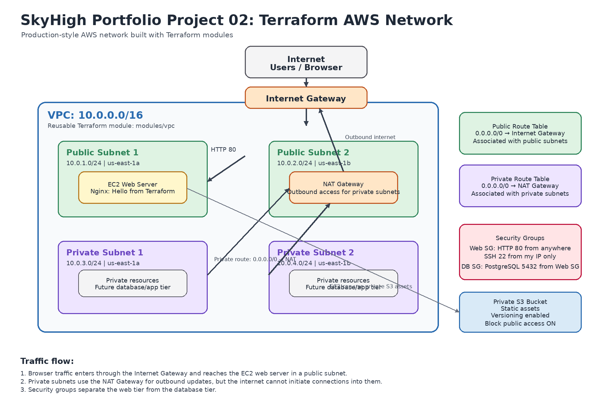

# SkyHigh Portfolio Project 02: Terraform AWS Network

## Project Description

This project builds a production-style AWS network using Terraform. The infrastructure includes a custom VPC, two public subnets, two private subnets, an Internet Gateway, NAT Gateway, route tables, security groups, an EC2 web server running Nginx, and a private S3 bucket for static assets. The VPC is built as a reusable Terraform module to follow real-world infrastructure-as-code organization patterns.

## Architecture Diagram



## Architecture Overview

The architecture includes:

* One VPC with CIDR block `10.0.0.0/16`
* Two public subnets across two Availability Zones
* Two private subnets across two Availability Zones
* Internet Gateway for public internet access
* NAT Gateway for private subnet outbound internet access
* Public route table routing internet traffic through the Internet Gateway
* Private route table routing outbound traffic through the NAT Gateway
* Web security group allowing HTTP from anywhere and SSH only from my IP
* Database security group allowing PostgreSQL access only from the web security group
* EC2 web server in a public subnet running Nginx
* Private S3 bucket with versioning enabled and public access blocked

## Tech Stack

* Terraform
* AWS VPC
* AWS EC2
* AWS S3
* AWS Internet Gateway
* AWS NAT Gateway
* AWS Security Groups
* Nginx
* Terraform Modules
* GitHub

## Project Structure

```text
skyhigh-portfolio-project-02/
├── main.tf
├── variables.tf
├── outputs.tf
├── security.tf
├── compute.tf
├── storage.tf
├── terraform.tfvars
├── .gitignore
├── README.md
└── modules/
    └── vpc/
        ├── main.tf
        ├── variables.tf
        └── outputs.tf
```

## Why I Used a VPC Module

I built the VPC as a reusable Terraform module because this is how real infrastructure teams organize cloud code. The VPC module contains the network foundation, including the VPC, subnets, Internet Gateway, NAT Gateway, and route tables. This makes the code cleaner, easier to reuse, and easier to scale for future environments like development, staging, and production.

Instead of placing all infrastructure into one large `main.tf` file, the reusable module separates the network layer from the application-specific resources like EC2, security groups, and S3.

## How to Run This Project

### 1. Initialize Terraform

```bash
terraform init
```

### 2. Format the Terraform files

```bash
terraform fmt -recursive
```

### 3. Validate the configuration

```bash
terraform validate
```

### 4. Preview the infrastructure

```bash
terraform plan
```

### 5. Apply the infrastructure

```bash
terraform apply
```

Type `yes` when prompted.

### 6. Test the web server

After Terraform finishes, copy the `web_server_public_ip` output and open it in a browser:

```text
http://<web_server_public_ip>
```

The page should display:

```text
Hello from Terraform!
```

### 7. Destroy the infrastructure

```bash
terraform destroy
```

Type `yes` when prompted.

## Terraform Outputs

This project outputs:

* VPC ID
* Public subnet IDs
* Private subnet IDs
* Web server public IP
* S3 bucket name

Example:

```text
vpc_id = "vpc-xxxxxxxx"
public_subnet_ids = ["subnet-xxxx", "subnet-yyyy"]
private_subnet_ids = ["subnet-aaaa", "subnet-bbbb"]
web_server_public_ip = "x.x.x.x"
s3_bucket_name = "skyhigh-assets-niyette-johnson-2026"
```

## Cost Note

This project includes a NAT Gateway, which is not free. The NAT Gateway can create charges while it is running, so the infrastructure should be destroyed after testing and taking screenshots.

To avoid unnecessary charges, I ran:

```bash
terraform destroy
```

after completing the project screenshots.

## Challenges and Solutions

### Challenge 1: IAM permissions blocked Terraform

When I first ran `terraform apply`, AWS returned permission errors for creating VPC and Elastic IP resources. The error showed that my IAM user did not have permission for actions like `ec2:CreateVpc` and `ec2:AllocateAddress`.

**Solution:** I updated the IAM permissions so Terraform could create EC2 networking resources, including the VPC, subnets, route tables, Internet Gateway, NAT Gateway, Elastic IP, security groups, and EC2 instance.

### Challenge 2: EC2 instance type issue

Terraform initially failed when creating the EC2 instance because the selected instance type was not eligible for my account’s Free Tier settings.

**Solution:** I checked which instance type was accepted and updated the Terraform configuration to use an eligible micro instance type.

### Challenge 3: Keeping the project organized

This project required multiple Terraform files and a reusable VPC module instead of one large `main.tf` file.

**Solution:** I separated the files by purpose:

* `main.tf` for provider and module call
* `security.tf` for security groups
* `compute.tf` for EC2
* `storage.tf` for S3
* `outputs.tf` for important outputs
* `modules/vpc/` for the reusable VPC module

This made the code easier to read and closer to real production Terraform structure.

## What I Would Do Differently in Production

In a production environment, I would improve this project by adding:

* Remote Terraform state using an S3 backend and DynamoDB state locking
* CI/CD pipeline for automated Terraform validation and deployment
* Separate environments for dev, staging, and production
* More restrictive security group rules
* Private EC2 instances behind an Application Load Balancer
* CloudWatch monitoring and alarms
* Multi-region disaster recovery planning
* Terraform variable validation and stronger tagging standards

## Final Result

The final Terraform deployment successfully created a complete AWS network with public and private subnets, internet access, private subnet outbound access through NAT, security groups, a working EC2 Nginx web server, and a private S3 bucket. This project demonstrates foundational infrastructure-as-code skills using Terraform and AWS.
